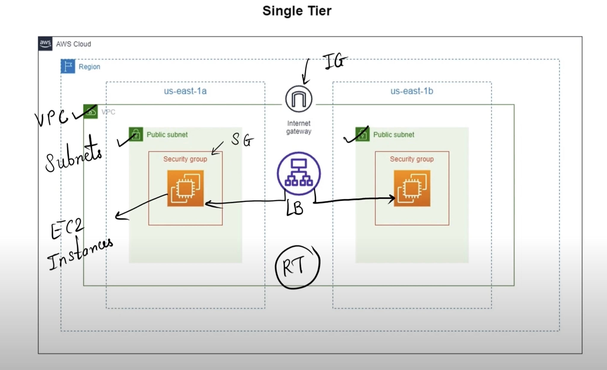
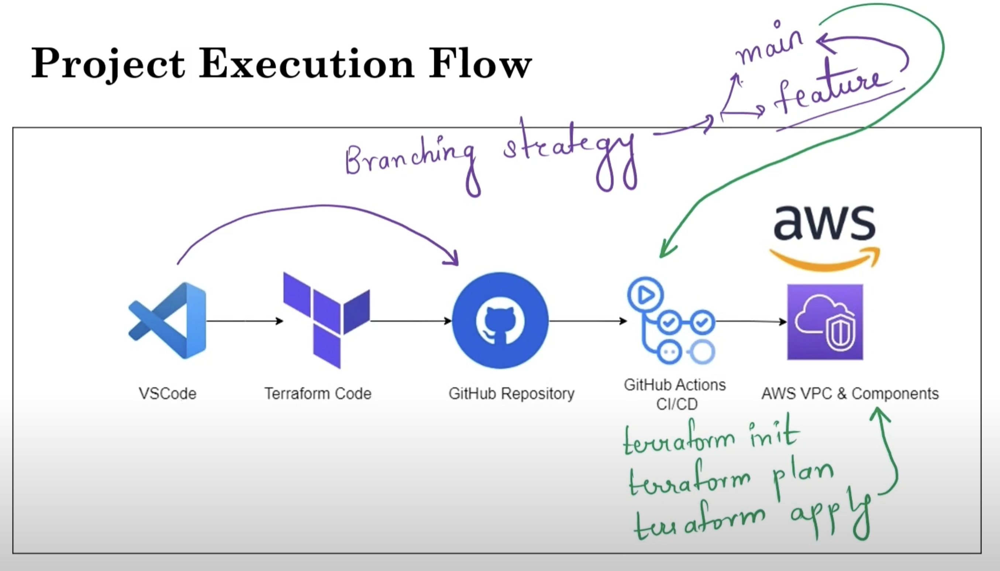
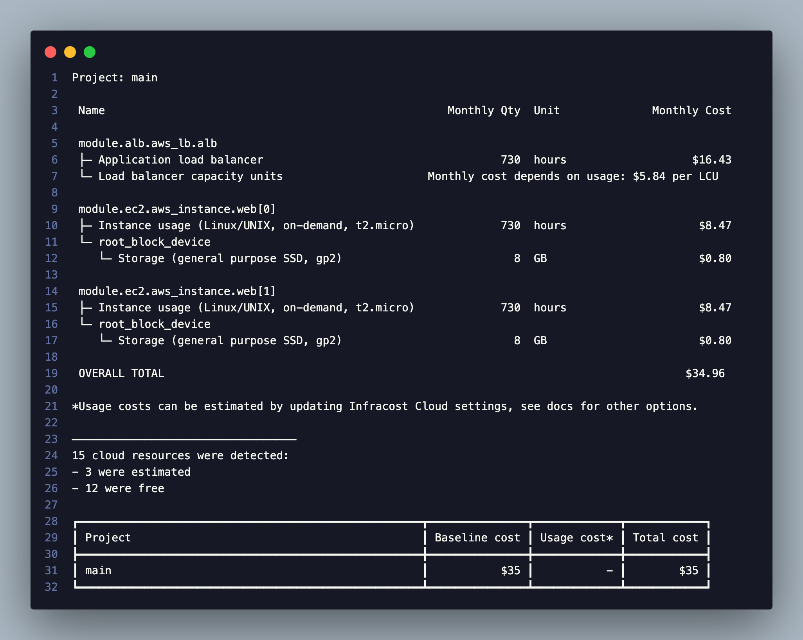

# Mastering VPC Creation with Terraform & GitHub Actions Automation

This repository demonstrates how to create and automate a Single Tier VPC in AWS using Terraform, integrated with GitHub Actions for CI/CD. The setup includes:

- VPC with Public Subnets
- EC2 Instances
- Security Groups
- Load Balancer
- Internet Gateway
- Route Tables

## Architecture Diagram



## Project Execution Flow



## Estimated Monthly Cost



## Example Running the App

[Click here to view the example video](https://github.com/user-attachments/assets/ac46778a-0bc3-4e3e-81d5-a352863fd6e4)

### Step-by-Step Guide

### Prerequisites

- Ensure that Terraform and AWS CLI are installed and configured on your machine.

#### Step 1: 🚀 Initial Setup

- Clone the repository: `git clone https://github.com/edwinhern/vpc-terraform.git`
- Navigate: `cd vpc-terraform`

#### Step 2: ⚙️ Environment Configuration

- Create a `terraform.tfvars` file in the root of `vpc-terraform` folder.
- Add the following configuration to terraform.tfvars:

    ```bash
    # AWS Configuration
    access_key = "ADD YOUR ACCESS_KEY"
    secret_key = "ADD YOUR SECRET KEY"
    # VPC
    vpc_cidr    = "10.0.0.0/16"
    subnet_cidr = ["10.0.1.0/24", "10.0.2.0/24"]
    ```

#### Step 3: 🏃‍♂️ Apply Terraform Configuration

- Navigate to the Terraform directory: `cd terraform`
- Run the scripts below:

    ```bash
    terraform init
    terraform plan
    terraform apply
    ```


